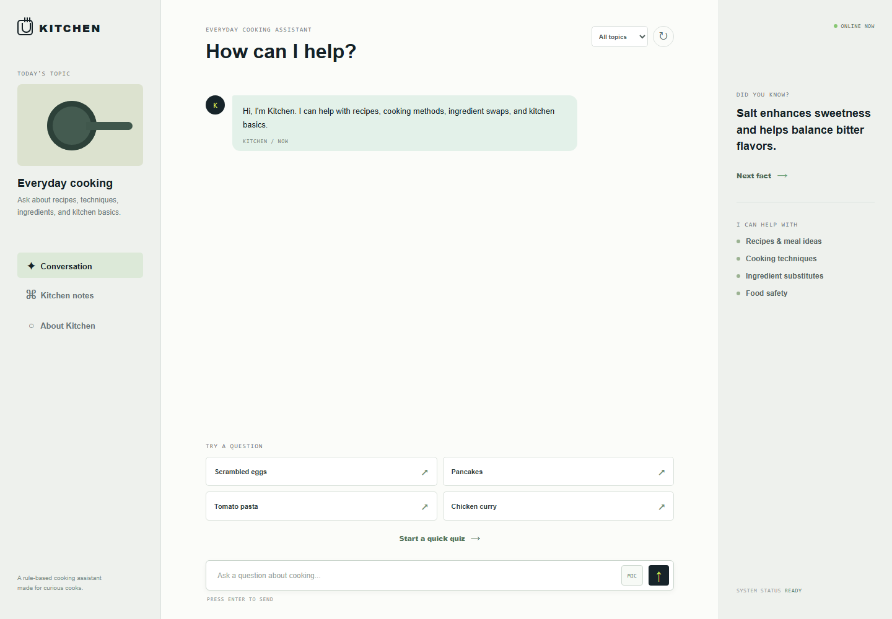
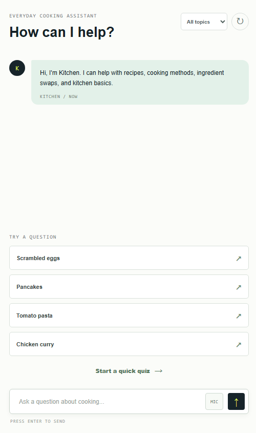

# Kitchen Chatbot

Kitchen Chatbot is a simple rule-based cooking assistant built for an AI Basics project. It accepts everyday cooking questions, matches keywords to predefined responses, and returns practical recipes or cooking guidance.

## Project Description

The chatbot demonstrates core conversational AI concepts without requiring an API or external model. It uses a predefined knowledge base, topic filtering, input handling, response fallbacks, and basic conversation state to guide users through common cooking questions.

## Features

- Complete recipes for pancakes, scrambled eggs, tomato pasta, chicken curry, vegetable fried rice, and white rice
- Rule-based responses for cooking techniques, substitutions, and chicken food safety
- Topic filters for recipes, techniques, and ingredients
- Quick-question buttons and a short cooking quiz
- Loading state before each response
- Browser-local chat history using `localStorage`
- Optional microphone input when supported by the browser
- Responsive layout for desktop and mobile screens

## Technologies and Tools

- HTML5
- CSS3
- Vanilla JavaScript
- Browser Web Speech API for optional voice input
- Python `http.server` for local development

## Installation and Setup

No package installation is required.

1. Download or clone this repository.
2. Open a terminal in the project folder.
3. Start a local server:

```powershell
python -m http.server 8000
```

4. Open `http://127.0.0.1:8000/` in a browser.

Alternatively, open `index.html` directly in a browser. A local server is recommended for the most consistent browser behavior.

## How It Works

When a user sends a question, the app normalizes the text and checks it against keyword groups in `script.js`. The best matching predefined response is displayed in the conversation. When there is no match, the chatbot explains which supported recipe and cooking topics it can answer.

## Screenshots





## Project Files

```text
index.html          Application structure
styles.css          Responsive styling
script.js           Chatbot rules and interactive behavior
screenshots/        Application screenshots
README.md           Project documentation
```
